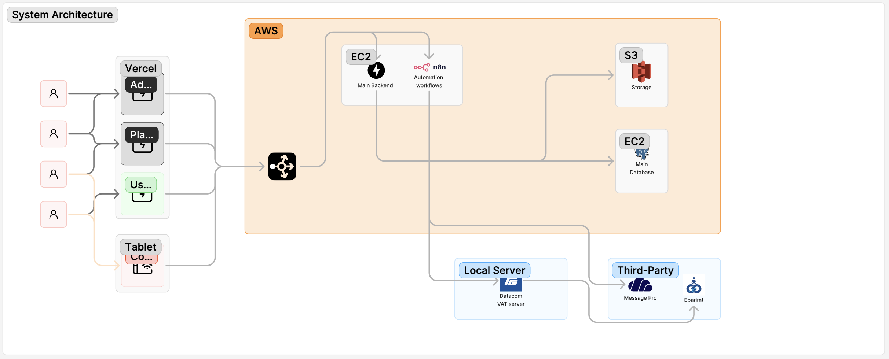

# Technical Design Document: Digital Menu & Food Ordering System

## 1. Background

This platform provides a modern digital menu and food ordering solution for restaurants, with a unique focus on take-out services. Customers can place orders for pick-up, and upon preparation completion, they receive an SMS notification. The order is placed in a heat-retaining container for convenient self-service pickup.

## 2. Requirements

### 2.1. Non-technical Requirements
*   **Company | Restaurant Control**
    *   Add new restaurant
    *   Disable restaurant
    *   Edit restaurant
    *   Get subscription payment bill information
    *   Menu control
    *   Add new foods to menu
    *   Control active foods from menu
*   **Order Control**
    *   Able to create new order from menu
    *   Two options: take-out and dine-in
    *   Kitchen receives order information in real-time
    *   Places order in a heat-retaining box if the order is for take-out
    *   Gives VAT receipt
*   **Heat-retaining Box**
    *   Able to place order
    *   Able to receive placed order
    *   Able to open containers by admin role
    *   Able to send fix request
*   **Insight**
    *   Sales
    *   ...etc
*   **Notification**
    *   Real-time with Kitchen
    *   By SMS to user
*   **Seating Area Control**
    *   Add or Remove tables
    *   Print QR for table
*   **User Control**
    *   Register new user
    *   Login user
    *   See user history
*   **Customer Support**
    *   FAQ page for Company Admin, Restaurant Admin, and User

### 2.2. Functional Requirements

*   Heat-retaining Box UI (Android App)
*   Main Admin UI (Web)
*   Restaurant Admin UI (Web)
*   User Order UI (Web)
*   Kitchen UI (Web)

## 3. Non-Goals
* No delivery service (not food delivery)
* No AI-based recommendations
* No table reservation system (if not included)
* No food rating/review feature
  
## 4. System Constraints
* Handle up to 100 orders/minute
* Max SMS delivery latency: 10 seconds
* Heat box open/close actions within 2 seconds
* Secure 4-6 digit pickup code verification
* Supported on Android 10+

## 5. Tech Stacks

### 5.1. 🌐 Frontend: SvelteKit

*   **Framework:** SvelteKit
*   **Language:** TypeScript
*   **Styling:** Tailwind CSS
*   **UI Components:** Skeleton UI
*   **Forms/Validation:** Zod
*   **Backend Integration:** TanStack Query
*   **Auth Integration:** Call Python backend for login/signup via API
*   **Hosting:** Vercel

### 5.2. 🐍 Backend: Python

*   **Framework:** Django
*   **Language:** Python
*   **Features:** Django REST Framework
*   **Hosting:** Docker on EC2

### 5.3. 🔁 Workflow Automation n8n 
* SMS triggers
* Daily reports
* Data syncs

*   **Use Cases:**
    *   Trigger SMS via webhook when the backend marks an order as ready.
    *   Send daily reports or inventory syncs.
    *   Create Insights.
*   **Deployment:** EC2 Docker

### 5.4. 📲 SMS / Notification

*   **Provider:** MessagePro

### 5.5. 🗄️ Database

*   **Database:** PostgreSQL
*   **Deployment:** Supabase

### 5.6. 📱 Android App

*   **Language:** Kotlin | Java
*   **UI:** Jetpack Compose
*   **HTTP:** Retrofit to call backend API

### 5.7 Security

* HTTPS enforced
* JWT-based Auth
* Role-based access control (RBAC)
* Passwords securely hashed
* Rate limiting on sensitive endpoints

## 6. User Stories

### 6.1. Restaurant Registration

We will assume that our salesperson will first reach out to restaurants and handle their registration through the admin web portal.

1.  **Salesperson** → Opens Admin portal.
2.  **Salesperson** → Navigates to the “Register new Restaurant” page.
3.  **Salesperson** → Fills in the necessary information about the new restaurant.
4.  **Salesperson** → Provides the username and password for the Restaurant Admin Portal to the newly registered restaurant.
5.  **Restaurant Admin** → Logs into the Restaurant Admin Portal.
6.  **Restaurant Admin** → Creates the menu.
7.  **Restaurant Admin** → Selects subscription options (e.g., heat-retaining container).
8.  **Restaurant Admin** → Creates the seating area (tables) and places QR codes for menus on the tables.

### 6.2. Insight

Insights serve two main purposes: first, to provide the owner or management with sales data and deeper operational insights; and second, to allow exporting Excel templates for integration with external finance and ERP platforms.

*   **Restaurant Admin Journey**
    1.  **Restaurant Admin** → Opens the Restaurant Admin Portal.
    2.  **Restaurant Admin** → Navigates to the insights tab.
    3.  **Restaurant Admin** → Sees all sales and deeper insights.
    4.  **Restaurant Admin** → Exports Excel templates (which can be uploaded to third-party finance platforms).
*   **Main Admin Journey**
    1.  **Main Admin** → Opens the Main Admin Portal.
    2.  **Main Admin** → Navigates to the insights tab.
    3.  **Main Admin** → Sees all sales and deeper insights (from all restaurants).
    4.  **Main Admin** → Exports Excel templates (which can be uploaded to third-party finance platforms).

### 6.3. Placing an Order

When placing an order, there are two options: ordering from the seating area for dine-in, or placing an online order for takeout.

*   **From Seating Area (Dine-In)**
    1.  **User** → Takes a seat in the seating area.
    2.  **User** → Scans the QR code on the table to see the menu and place an order.
    3.  **User** → Selects food and places the order (Payment → Gets VAT Receipt).
    4.  **Kitchen** → Receives and starts preparing the order.
    5.  **Kitchen** → Finishes the food and closes the order.
    6.  **Waiter** → Delivers the food to the ordered table.
*   **From Online (Takeout)**
    1.  **User** → Scans a QR code or clicks on a link to place an online order.
    2.  **User** → Selects food and places the order (Payment → Gets VAT Receipt).
    3.  **Kitchen** → Receives and starts preparing the order.
    4.  **Kitchen** → Finishes the food.
    5.  **Waiter** → Gets the ordered food and places it in a warm, heat-retaining box.
    6.  **Software** → Sends an SMS to notify the user that the order is ready.
    7.  **User** → Comes to the restaurant and retrieves the food from the heat-retaining box by entering a 4-6 digit number received via SMS.
    8.  **Software** → Closes the order.

## 7. Architecture
* Clients: Web UIs, Android App
* Gateway/API: Django REST Framework
* Database: PostgreSQL
* SMS Automation: n8n
* Notifications: WebSockets / SMS
* File Storage: Supabase



## 8. Data Models

*   **User**
    ```python
    class User(models.Model):
        first_name = models.CharField(max_length=255)
        last_name = models.CharField(max_length=255)
        phone = models.CharField(max_length=20, unique=True)
        email = models.EmailField(unique=True)
        role = models.ForeignKey('Role', on_delete=models.PROTECT)
        created_at = models.DateTimeField(auto_now_add=True)
        updated_at = models.DateTimeField(auto_now=True)
    ```

*   **Role**
    ```python
    class Role(models.Model):
        name = models.CharField(max_length=50, unique=True)  # e.g., 'admin', 'restaurant', 'customer'
    ```

*   **Permission**
    ```python
    class Permission(models.Model):
        name = models.CharField(max_length=255, unique=True)  # e.g., 'create_user', 'delete_post'
        description = models.TextField()
        resource = models.CharField(max_length=100)  # e.g., 'user', 'post'
        action = models.CharField(max_length=50)  # e.g., 'create', 'read', 'update', 'delete'
    ```

*   **RolePermission**
    ```python
    class RolePermission(models.Model):
        role = models.ForeignKey('Role', on_delete=models.CASCADE)
        permission = models.ForeignKey('Permission', on_delete=models.CASCADE)

        class Meta:
            unique_together = ('role', 'permission')
    ```

*   **Restaurant**
    ```python
    class Restaurant(models.Model):
        name = models.CharField(max_length=255)
        password = models.CharField(max_length=255) # Should be hashed
        address = models.CharField(max_length=255, null=True, blank=True)
        subscription = models.ForeignKey('Subscription', on_delete=models.SET_NULL, null=True, blank=True)
        created_at = models.DateTimeField(auto_now_add=True)
        updated_at = models.DateTimeField(auto_now=True)
    ```

*   **Table**
    ```python
    class Table(models.Model):
        restaurant = models.ForeignKey('Restaurant', on_delete=models.CASCADE)
        table_number = models.CharField(max_length=50)
        seat_capacity = models.IntegerField(null=True, blank=True)
        table_qr = models.CharField(max_length=255, blank=True)
    ```

*   **BoxContainer**
    ```python
    class BoxContainer(models.Model):
        restaurant = models.ForeignKey('Restaurant', on_delete=models.CASCADE)
        container_code = models.CharField(max_length=255, unique=True)
        box_quantity = models.IntegerField()
        created_at = models.DateTimeField(auto_now_add=True)
        updated_at = models.DateTimeField(auto_now=True)
    ```

*   **Box**
    ```python
    class Box(models.Model):
        container = models.ForeignKey('BoxContainer', on_delete=models.CASCADE)
        serial_code = models.CharField(max_length=255, unique=True)
        is_active = models.BooleanField(default=True)
        capacity = models.CharField(max_length=255, blank=True)
        created_at = models.DateTimeField(auto_now_add=True)
        updated_at = models.DateTimeField(auto_now=True)
    ```

*   **ItemCategory**
    ```python
    class ItemCategory(models.Model):
        name = models.CharField(max_length=255)  # e.g., 'FOOD', 'DESSERT'
        restaurant = models.ForeignKey('Restaurant', on_delete=models.CASCADE)

        class Meta:
            unique_together = ('name', 'restaurant')
    ```

*   **MenuItem**
    ```python
    from django.contrib.postgres.fields import ArrayField

    class MenuItem(models.Model):
        restaurant = models.ForeignKey('Restaurant', on_delete=models.CASCADE)
        name = models.CharField(max_length=255)
        price = models.DecimalField(max_digits=10, decimal_places=2)
        img_urls = ArrayField(models.URLField(), blank=True, default=list)
        description = models.TextField(blank=True)
        meta_data = models.JSONField(default=dict)  # { "calories": "", "ingredients": [] }
        is_available = models.BooleanField(default=True)
        categories = models.ManyToManyField('ItemCategory')
        created_at = models.DateTimeField(auto_now_add=True)
        updated_at = models.DateTimeField(auto_now=True)
    ```

*   **Order**
    ```python
    class Order(models.Model):
        class OrderStatus(models.TextChoices):
            PENDING = 'PENDING', 'Pending'
            PREPARING = 'PREPARING', 'Preparing'
            CANCELLED = 'CANCELLED', 'Cancelled'
            IN_BOX = 'IN_BOX', 'In Box'
            DONE = 'DONE', 'Done'

        class OrderType(models.TextChoices):
            DINE_IN = 'DINE_IN', 'Dine-In'
            TAKE_OUT = 'TAKE_OUT', 'Take-Out'

        user = models.ForeignKey('User', on_delete=models.CASCADE)
        restaurant = models.ForeignKey('Restaurant', on_delete=models.CASCADE)
        order_status = models.CharField(max_length=20, choices=OrderStatus.choices, default=OrderStatus.PENDING)
        total_price = models.DecimalField(max_digits=10, decimal_places=2)
        table = models.ForeignKey('Table', null=True, blank=True, on_delete=models.SET_NULL)
        box = models.ForeignKey('Box', null=True, blank=True, on_delete=models.SET_NULL)
        order_type = models.CharField(max_length=20, choices=OrderType.choices, default=OrderType.DINE_IN)
        created_at = models.DateTimeField(auto_now_add=True)
        updated_at = models.DateTimeField(auto_now=True)
    ```

*   **OrderItem**
    ```python
    class OrderItem(models.Model):
        order = models.ForeignKey('Order', on_delete=models.CASCADE, related_name='items')
        menu_item = models.ForeignKey('MenuItem', on_delete=models.CASCADE)
        quantity = models.IntegerField()
        unit_price = models.DecimalField(max_digits=10, decimal_places=2)
    ```

*   **PaymentMethod**
    ```python
    class PaymentMethod(models.Model):
        name = models.CharField(max_length=255) # e.g., 'APPLE_PAY', 'QPAY'
        user = models.ForeignKey('User', on_delete=models.CASCADE)
    ```

*   **OrderPayment**
    ```python
    class OrderPayment(models.Model):
        class PaymentStatus(models.TextChoices):
            PENDING = 'PENDING', 'Pending'
            COMPLETED = 'COMPLETED', 'Completed'
            FAILED = 'FAILED', 'Failed'

        order = models.ForeignKey('Order', on_delete=models.CASCADE)
        amount = models.DecimalField(max_digits=10, decimal_places=2)
        status = models.CharField(max_length=20, choices=PaymentStatus.choices, default=PaymentStatus.PENDING)
        payment_method = models.ForeignKey('PaymentMethod', on_delete=models.SET_NULL, null=True)
        paid_at = models.DateTimeField(null=True, blank=True)
    ```

*   **SubscriptionPlan**
    ```python
    class SubscriptionPlan(models.Model):
        class Interval(models.TextChoices):
            MONTHLY = 'monthly', 'Monthly'
            YEARLY = 'yearly', 'Yearly'

        name = models.CharField(max_length=255)
        description = models.TextField()
        price = models.DecimalField(max_digits=10, decimal_places=2)
        interval = models.CharField(max_length=10, choices=Interval.choices)
        is_active = models.BooleanField(default=True)
        created_at = models.DateTimeField(auto_now_add=True)
    ```

*   **Subscription**
    ```python
    class Subscription(models.Model):
        class SubscriptionStatus(models.TextChoices):
            ACTIVE = 'active', 'Active'
            TRIALING = 'trialing', 'Trialing'
            CANCELLED = 'cancelled', 'Cancelled'
            EXPIRED = 'expired', 'Expired'
            PAST_DUE = 'past_due', 'Past Due'

        restaurant = models.ForeignKey('Restaurant', on_delete=models.CASCADE)
        plan = models.ForeignKey('SubscriptionPlan', on_delete=models.CASCADE)
        status = models.CharField(max_length=20, choices=SubscriptionStatus.choices)
        start_date = models.DateTimeField()
        end_date = models.DateTimeField()
        trial_end = models.DateTimeField(null=True, blank=True)
        cancel_at_period_end = models.BooleanField(default=False)
        canceled_at = models.DateTimeField(null=True, blank=True)
        renewal_date = models.DateTimeField()
        created_at = models.DateTimeField(auto_now_add=True)
    ```

*   **Invoice**
    ```python
    class Invoice(models.Model):
        class InvoiceStatus(models.TextChoices):
            DRAFT = 'draft', 'Draft'
            OPEN = 'open', 'Open'
            PAID = 'paid', 'Paid'
            VOID = 'void', 'Void'

        subscription = models.ForeignKey('Subscription', on_delete=models.CASCADE)
        invoice_number = models.CharField(max_length=255, unique=True)
        amount_due = models.DecimalField(max_digits=10, decimal_places=2)
        amount_paid = models.DecimalField(max_digits=10, decimal_places=2)
        due_date = models.DateTimeField()
        status = models.CharField(max_length=10, choices=InvoiceStatus.choices, default=InvoiceStatus.DRAFT)
    ```

*   **SMSLog**
    ```python
    class SMSLog(models.Model):
        to = models.CharField(max_length=20)
        restaurant = models.ForeignKey('Restaurant', on_delete=models.SET_NULL, null=True)
        text = models.TextField()
        sent_at = models.DateTimeField(auto_now_add=True)
    ```

## 9. API Endpoint
* **Authentication**
    * `POST /api/auth/login`: User login.
        * **Request Body**: `{ "email": "user@example.com", "password": "password" }`
        * **Response Body**: `{ "token": "jwt_token" }`
    * `POST /api/auth/register`**: User registration.
        * **Request Body**: `{ "first_name": "John", "last_name": "Doe", "phone": "1234567890", "email": "user@example.com", "password": "password" }`
        * **Response Body**: `{ "user_id": 1, "email": "user@example.com" }`

* **Restaurants**
    * `GET /api/restaurants`: Get a list of all restaurants (for main admin).
        * **Auth**: Main Admin
        * **Response Body**: `[{ "id": 1, "name": "Pizza Place", ... }]`
    * `POST /api/restaurants`: Create a new restaurant (for main admin).
        * **Auth**: Main Admin
        * **Request Body**: `{ "name": "New Burger Joint", "address": "123 Main St", ... }`
        * **Response Body**: `{ "id": 2, "name": "New Burger Joint", ... }`
    * `GET /api/restaurants/{restaurant_id}`: Get details for a specific restaurant.
        * **Auth**: Main Admin, Restaurant Admin (own restaurant)
        * **Response Body**: `{ "id": 1, "name": "Pizza Place", ... }`
    * `PUT /api/restaurants/{restaurant_id}`: Update a restaurant's details.
        * **Auth**: Main Admin, Restaurant Admin (own restaurant)
        * **Request Body**: `{ "name": "Updated Pizza Place", ... }`
        * **Response Body**: `{ "id": 1, "name": "Updated Pizza Place", ... }`

* **Menu Items**
    * `GET /api/restaurants/{restaurant_id}/menu-items`: Get all menu items for a restaurant.
        * **Auth**: Public
        * **Response Body**: `[{ "id": 1, "name": "Margherita Pizza", "price": "12.99", ... }]`
    * `POST /api/restaurants/{restaurant_id}/menu-items`: Add a new menu item.
        * **Auth**: Restaurant Admin
        * **Request Body**: `{ "name": "Pepperoni Pizza", "price": "14.99", ... }`
        * **Response Body**: `{ "id": 2, "name": "Pepperoni Pizza", ... }`
    * `PUT /api/restaurants/{restaurant_id}/menu-items/{item_id}`: Update a menu item.
        * **Auth**: Restaurant Admin
        * **Request Body**: `{ "price": "15.99" }`
        * **Response Body**: `{ "id": 2, "name": "Pepperoni Pizza", "price": "15.99", ... }`
    * `DELETE /api/restaurants/{restaurant_id}/menu-items/{item_id}`: Delete a menu item.
        * **Auth**: Restaurant Admin
        * **Response**: `204 No Content`

* **Orders**
    * `POST /api/orders`: Create a new order.
        * **Auth**: Authenticated User
        * **Request Body**: `{ "restaurant_id": 1, "order_type": "TAKE_OUT", "items": [{ "menu_item_id": 1, "quantity": 2 }] }`
        * **Response Body**: `{ "id": 1, "status": "PENDING", "total_price": "25.98", ... }`
    * `GET /api/orders/{order_id}`: Get the status of an order.
        * **Auth**: Authenticated User (own order), Restaurant Admin
        * **Response Body**: `{ "id": 1, "status": "PREPARING", ... }`
    * `PUT /api/orders/{order_id}`: Update order status (e.g., from "PREPARING" to "IN_BOX").
        * **Auth**: Restaurant Admin
        * **Request Body**: `{ "status": "IN_BOX" }`
        * **Response Body**: `{ "id": 1, "status": "IN_BOX", ... }`